<h1 align="center">
     
    DEVONthink 3 Portal 
    
    

</h1>

**Use A** ` dvn [ ] [ . ] [ {query} ] `

- `dvn ` No input displays all available databases
- `dvn .` Displays global actionable options
- `dvn {query}` Initiate global search

**Use B** ` ddvn [ {query} ] `  
- `ddvn {query}` triggers a file filter brute-force search (fast)

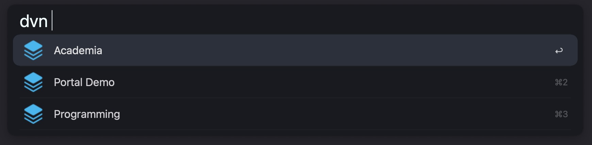

## Feature Overview (Selection)

- Global and Database Search
- Tag Search with auto suggest
- Document Actions 
    - move, replicate, duplicate, create annotation file, find similar items, etc.
	- Extra: Get the BibTeX or formatted citation from DOI, ISBN or the latter from existing BibTeX[^1]
- Multiple Document Actions 
    - move, replicate, open all, **reciprocal linking**, etc. (Attention![^2])
- Navigate the Folder Structure
- Import New Documents to Location
- Customizable Annotation Templates
- Copy Page Link for open PDF documents
- Colored Labels (customize as needed)
	- Colored Flags on labeled records

## Actionable Options

**Global Options** Trigger: ` dvn . `

- Find Groups
- Show Favorites
- Show Reading List
- Filter Smart Groups
- Load Workspace
- Save Workspace
- Find records similar to a given string 
	- Impacted by the configuration variable `Score Threshold`

**Database Options** Trigger: ` dvn |dbs|2| . `

- Find Groups in Database
- Access Default Groups
    - Inbox
	- Annotations
	- Trash
	- Tags (autocompletes to tag search)

---

## Search

### Default Search

The search behaves the same as in DEVONthink, but by default only returns documents, i.e. groups, smart groups and tag groups are ignored. The workflow respects DEVONthink prefixes, operators and wildcards, giving you full control over the query. Examples: 
- `name:~keyword` 
- `name:<keyw kind:!ordinarytag` 
- `keyword {any: tags:affekt*;ratio*}`

This also allows you set up custom hotkeys by providing the desired query as argument to the workflow input.  

Reference Location for Search Prefixes

<code>file:///Applications/DEVONthink%203.app/Contents/Resources/DEVONthink.help/Contents/Resources/pgs/appendix-searchprefixes.html</code>

Reference Location for Search Operators

<code>file:///Applications/DEVONthink%203.app/Contents/Resources/DEVONthink.help/Contents/Resources/pgs/appendix-operators.html</code>

 

Within the database root or some folder, the asterisk `*` will return all contents of that location.

### Tag Search

Queries can be refined with tags at any point. Type the octothorp symbol and start entering the name of the desired tag. The workflow will auto suggest tags from your DEVONthink databases. 

Tags come in three flavors:
- `#tag` defines a strict requirement (show only documents that have this tag)
- `#tag?` defines an optional requirement (show documents that either have this tag, or another optional tag)
- `#!tag` defines a tag that is to be excluded (do not show documents that have this tag)

**Autocomplete Modifiers**

Tag suggestions can be autocompleted to match the above mentioned flavors.
- `default` the document must have this tag (`#tag`)
- `cmd` the document must not have this tag (`#!tag`)
- `opt` the document may have this tag (`#tag?`)

Expand for preview

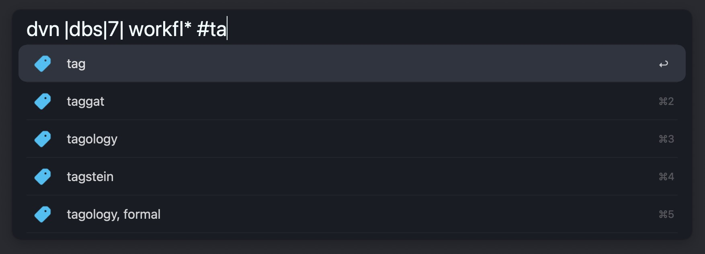

## Entry and Results

- `default` Enter Database Search
- `cmd` List all Tags in Database
- `opt` Open Database in DEVONthink

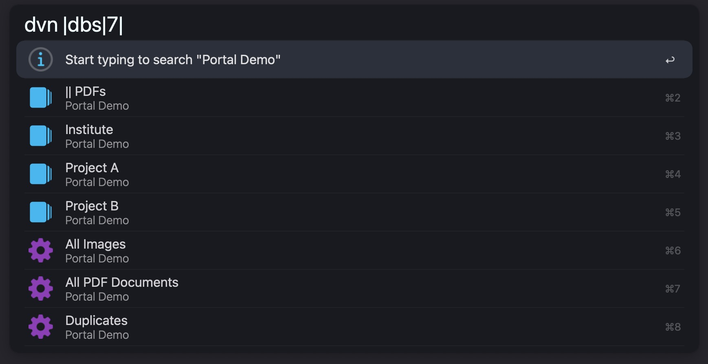

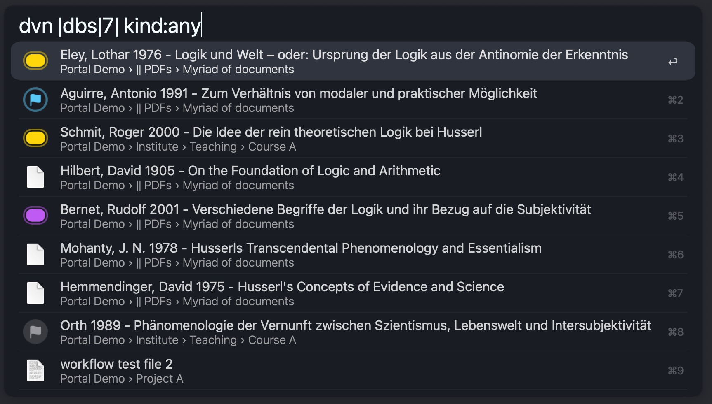
- `default` Enter Record Action
- `cmd` Display Tags
- `opt` Open in DEVONthink or default application (configuration)
- `ctrl` Reveal in DEVONthink

## Record Actions

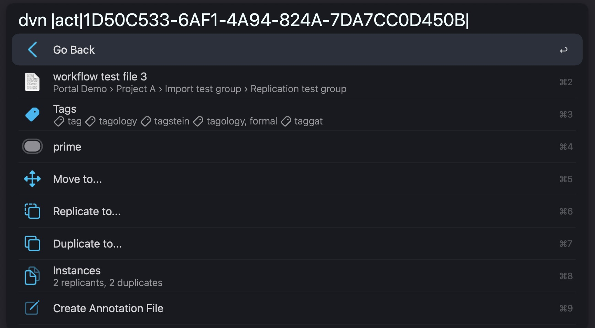
`⌘2` Main Record
- `cmd` Open in default application or in DEVONthink (configuration)
- `cmd+C` Copy item link or page link if the record is open in a DEVONthink document window (configuration)
- `cmd+shift` Copy Markdown Link
- `opt` Reveal in DEVONthink

`⌘8` Instances (configuration)

Expand Preview

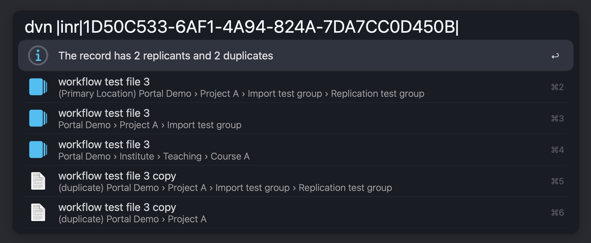

 

`⌘9` Create Annotation File (see `Annotation Templates` below)

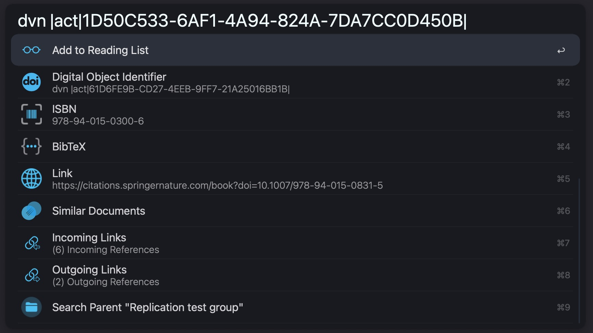

`⌘2,3` DOI, ISBN
- `cmd` Get BibTeX or CSL formatted citation via the *µBib Workflow* (WIP)

`⌘4` BibTeX 
- `cmd` Get CSL formatted citation via the *µBib Workflow* (WIP)

`⌘7,8`
- View incoming or outgoing (Wiki) Links or Mentions. 
- *Linking records* together injects references into the records metadata, which will be registered as incoming or outgoing links by DEVONthink

## Hotkey and Universal Action

You can send your selection to the `dvn Universal Action` from either the file system or from within DEVONthink. To act on the records currently selected in DEVONthink, you can also use the hotkey `cmd+shift+D` by default. 

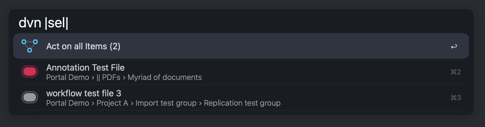
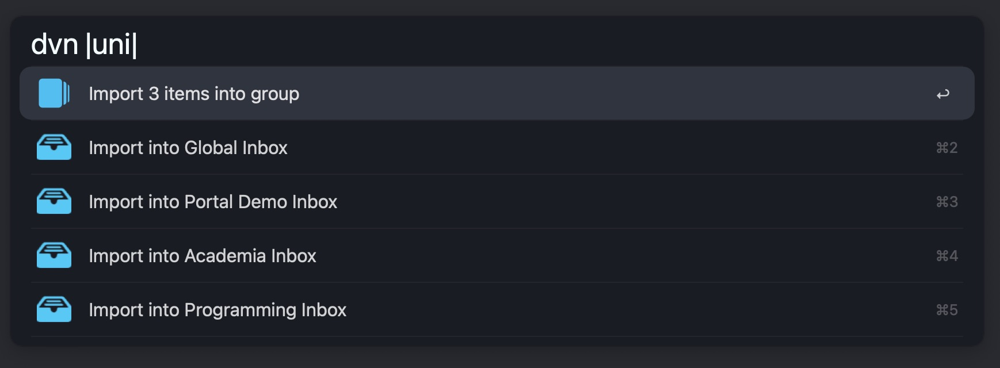

### Buffered Records

You can push records to Alfreds file buffer to perform actions on all of them, such as moving, replicating, or linking them together. 

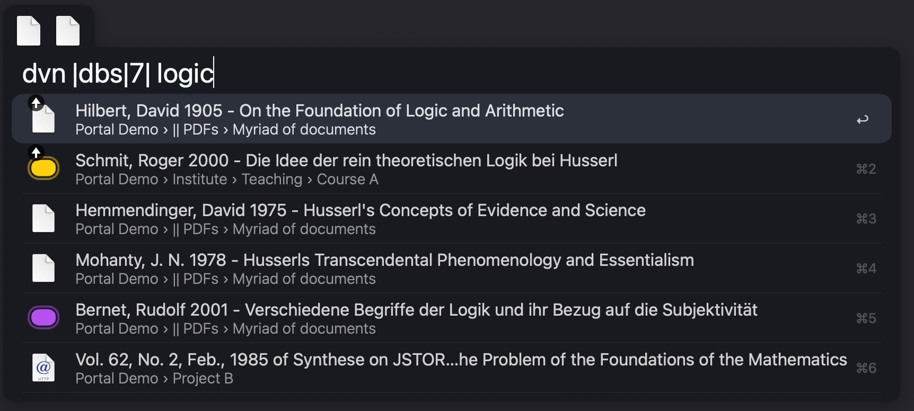
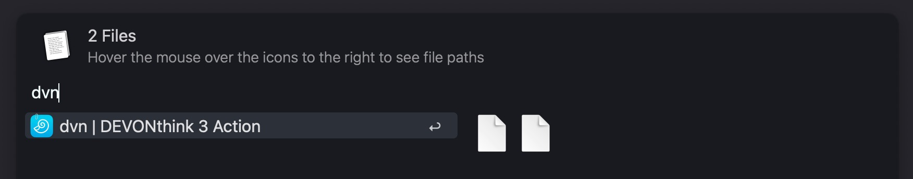
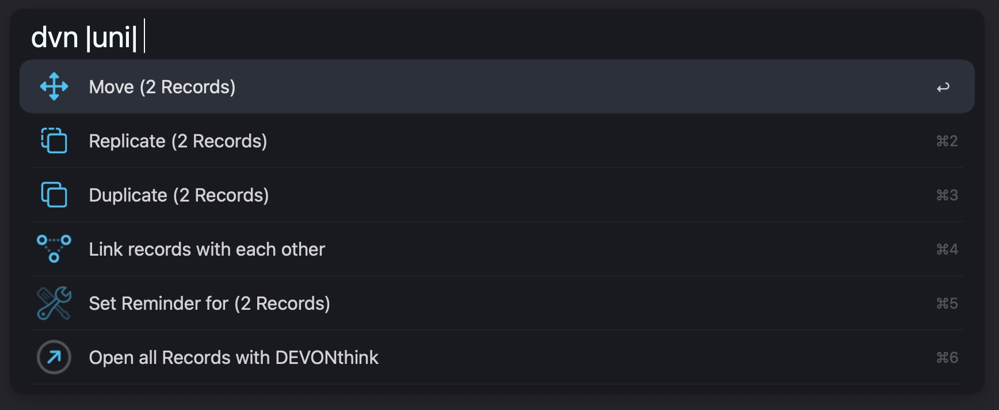

## On Reciprocal Linking

Expand to see more information

WIP. For now, make sure the custom metadata field `mdlinkedrecords` is not taken or change it in the configuration to avoid conflicts.

## Custom Metadata 

The workflow responds to the following DEVONthink custom metadata identifiers:

- `mddoi`: DOI
- `mdisbn`: ISBN
- `mdlink`: Link
- `mdlinkedrecords`: Linked Records (configurable) [^2]

## Annotation Templates

You can create custom templates that will be used when creating an *annotation file* for some record, i.e. a markdown document that is associated with it. You can customize your templates in `/assets/annotations`. These `placeholder` variables are currently supported:
- `%recordName%`
- `%documentLink%`
- `%year%`
- `%month%`
- `%day%`
- `%hour%`
- `%minute%`

# Plugins

- µBib
    - `WIP`
- PDF Expert
    - Copy the DEVONthink page link for the page currently viewed in PDF Expert

# Notes

- Supports DEVONthink 3.8.7 or later. Version 3.8.7 brought breaking changes to the scripting bridge.
- TIP: Fine-tuning the threshold becomes more interesting the larger your database grows. High thresholds for small databases can be detrimental to accuracy.

# Endnotes

- [^1]: Optional. Requires the `µBib` Workflow to be installed. DEVONthink will try to automatically extract DOIs from documents. However, this does not always succeed. You can help DEVONthink out by adding a custom metadata field with the identifier `DOI`. [µBib on Github](https://www.github.com/zeitlings/alfred-ubib/) (`WIP`).

- [^2]: Attention! Potentially replaces preconfigured data if the custom metadata identifier for *Linked Records* (`mdlinkedrecords`) is already used. Change this value in the configuration to avoid conflicts if necessary.