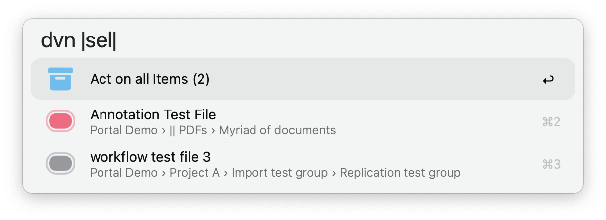

<h1 align="center">
     
    DEVONthink 3 Portal 
    
    <!--  -->
<!--  -->

</h1>

Advanced DEVONthink 3 interface for your databases. Search files or groups and interact with them through Alfred.

<!--
**Use A** ` dvn [ ] [ . ] [ {query} ] `
<table>
    <tr>
	<td align="right"><code>dvn </code></td>
	<td>No input displays all available databases</td>
    </tr>
    <tr>
	<td align="right"><code>dvn .</code></td>
	<td>Displays global actionable options</td>
    </tr>
    <tr>
	<td align="right"><code>dvn {query}</code></td>
	<td>Initiate global search</td>
    </tr>
</table>
-->

**Use A** ` dvn [ ] [ . ] [ {query} ] `
- `dvn ` Displays the available databases
- `dvn .` Displays global actions
- `dvn {query}` Initiates a global search
- `dvn :c` Shows internal configuration

**Use B** ` ddvn [ {query} ] `  
- `ddvn {query}` Initiates a file filter brute-force search (fast)

## Feature Overview (Selection)

- Global and Database Search
- Tag Search with Auto Suggest
- Document Actions 
    - move, replicate, duplicate, create annotation file, find similar items, etc.
	- >`Extra` Get the BibTeX reference or CSL formatted citation from a DOI, ISBN or jstore URL.  
	  > CSL formatted citations can also be generated from an existing BibTeX reference.[^1]
- Multiple Document Actions 
    - move, replicate, open all, **reciprocal linking**, etc. 
    - > __Note__[^2]
- Navigate the Folder Structure
- Import New Documents to Location
- Customizable Annotation Templates
- Colored Labels (customize as needed)
	- Colored Flags on Labeled Records
- Copy Page Link for open PDF Documents

## Actionable Options

**Global Options** Trigger: ` dvn . `

- Find Groups
- Show Favorites
- Show Reading List
- Today
- Recently Modified
- Recently Added
- Due Soon
- Overdue
- Filter Smart Groups
- Load Workspace
- Save Workspace
- Find Records similar to a given String
	- Affected by the `Score Threshold` configuration variable

**Database Options** Trigger: ` dvn |dbs|2| . `

- Find Groups in Database
- Access Default Groups & Filters
    - Inbox
	- Annotations
	- Trash
	- Tags (autocompletes to tag search)
    - Today
    - Recently Modified
    - Recently Added
    - Due Soon
    - Overdue
---

## Search

### Default Search

The search behaves the same as in DEVONthink, but by default only returns documents, i.e. groups, smart groups and tag groups are ignored. The workflow respects DEVONthink prefixes, operators and wildcards, giving you full control over the query. Examples: 
- `name:~keyword` 
- `name:<keyw kind:!ordinarytag` 
- `keyword {any: tags:affekt*;ratio*}`
- `judgement label:2` or, for instance, `judgement label:urgent`

<!-- This also allows you set up custom hotkeys by providing the desired query as argument to the workflow input. -->

> __Note__  
> Within the database root or any folder, typing an asterisk `*` will return the entire contents of that location.

	
Path to local documentation for <b>Search Prefixes</b>

	<pre>file:///Applications/DEVONthink%203.app/Contents/Resources/DEVONthink.help/Contents/Resources/pgs/appendix-searchprefixes.html</pre>

	
Path to local documentation for <b>Search Operators</b>

	<pre>file:///Applications/DEVONthink%203.app/Contents/Resources/DEVONthink.help/Contents/Resources/pgs/appendix-operators.html</pre>

 

### Tag Search

Queries can be refined with tags at any point. Type the octothorp symbol and start entering the name of the desired tag. The workflow will auto suggest tags from your DEVONthink databases. 

Tags come in three flavors:
- `#tag` defines a strict requirement (show only documents that have this tag)
- `#tag?` defines an optional requirement (show documents that either have this tag, or another optional tag)
- `#!tag` defines a tag that is to be excluded (do not show documents that have this tag)

**Autocomplete Modifiers**

Tag suggestions can be autocompleted to match the above mentioned flavors.
- `default` the document must have this tag (`#tag`)
- `cmd` __⌘__ the document must not have this tag (`#!tag`)
- `opt` __⌥__ the document may have this tag (`#tag?`)

Expand for preview

## Entry Point and Search Results

- `default` Enter Database Search
- `cmd` __⌘__ List all Tags in Database
- `opt` __⌥__ Open Database in DEVONthink

- __⌘1__ `⏎` return key steps into the parent group
- __⌘2__ `⏎` return key steps into the targeted group

### Search Results

Press the `⏎` return key to access the [actions](#record-actions) available for the record.

| Modifier 	| Action 	| Configuration 	|
|---:		|:--		|:---:			|
| `cmd` 	| Display Tags 	|  	|
| `opt` 	| Open in DEVONthink or Default Application 	| ⦿ 	|
| `ctrl` 	| Reveal in DEVONthink 	|  		|
| `shift` or `cmd+Y` 	| Quick Look Preview 	|  	|
| `cmd+L` 	| Large Type showing the File Name, Location and Tags 	|  	|
| `fn` 		| View the score of the record (responds to the configured *threshold*)	| ⦿ 	|

> __Note__  
> Press the `⏎` return key while the workflow is retrieving the search results to launch DEVONthink with the given query.

## Record Actions

|  |
|:--:|
| Record Actions - A |

### ` ⌘2 ` The Main Record

Press the `⏎` return key to open the record in DEVONthink or the default application for the file type (Configuration).

| Modifier 	| Action 	| Configuration 	|
|---:	|:---	|:---:	|
| `cmd`  	| Open in default application or in DEVONthink 	| ⦿ 	|
| `cmd+c` 	| Copy item link or page link if the record is open in a DEVONthink document window 	| ⦿ 	|
| `cmd+shift` 	| Copy Markdown Link 	|  	|
| `opt+shift` 	| Copy page link (unless set as default) 	| ⦿ 	|
| `opt` 	| Reveal in DEVONthink 	|  	|

### ` ⌘5 ` Move Record

Press the `⏎` return key to select a new location for the record. If the record has replicants, you will have to decide which instance to move on a subsequent view (Configuration).

### ` ⌘8 ` Instances (Configuration)

Press the `⏎` return key to explore the instances, that is, replicants and duplicates of the record.

Expand to preview

 

### ` ⌘9 ` Create an Annotation File for the Record

If an annotion file already exists for the record, that file is displayed instead.

> __Note__ See [`Annotation Templates`](#annotation-templates)

---

|  |
|:--:|
| Record Actions - B |

### ` ⌘2 ⌘3 ` DOI and ISBN

| Modifier 	| Action 	| Configuration 	|
|---:		|:---		|:---:			|
| `cmd` 	| Get the BibTeX reference or CSL formatted citation via the *µBib Workflow* | ⦿ |
| `cmd+c` 	| Copy to clipboard | |

### ` ⌘4 ` BibTeX 

| Modifier 	| Action 	| Configuration 	|
|---:		|:---		|:---:			|
| `cmd` 	| Get CSL formatted citation via the *µBib Workflow* | ⦿ |
| `cmd+c` 	| Copy to clipboard | |

### ` ⌘7 ⌘8 ` Incoming and Outgoing Links

View incoming or outgoing (wiki) links or mentions. 
> __Note__  
> *Linking records* together injects references into the custom metadata of the records, which are registered by DEVONthink as inbound or outbound links. See [`On Reciprocal Linking`](#on-reciprocal-linking)

## Hotkey and Universal Action

You can send your selection to the `dvn Universal Action` from either the file system or from within DEVONthink. To act on the records currently selected in DEVONthink, you can also use the hotkey `cmd+shift+D` by default. 

The most recently used import location is remembered for quick access. The number of remembered import locations can be defined in the Wokflow Configuration.

### Buffered Records

You can push records to Alfreds file buffer to perform actions on all of them, such as moving, replicating, or linking them together. 

Send all buffered items to the Universal Action interface with ⌥+▶

## On Reciprocal Linking

> __Warning__  
> Potentially replaces preconfigured data if the custom metadata identifier `mdlinkedrecords` is already in use. Change this value in the configuration to avoid conflicts if necessary.

<!-- 

Expand to see more information

WIP. For now, make sure the custom metadata field `mdlinkedrecords` is not taken or change it in the configuration to avoid conflicts.

 
-->

## Custom Metadata 

The workflow responds to the following DEVONthink custom metadata identifiers:

- `mddoi`: DOI
- `mdisbn`: ISBN
- `mdlink`: Link
- `mdlinkedrecords`: Linked Records (Configuration[^2])

## Annotation Templates

You can create custom templates that will be used when creating an *annotation file* for some record, i.e. a markdown document that is associated with it. You can customize your templates in `/assets/annotations`. These `placeholder` variables are currently supported:
- `%recordName%`
- `%documentLink%`
- `%year%`
- `%month%`
- `%day%`
- `%hour%`
- `%minute%`

## Plugins

- [**µBib**](https://www.github.com/zeitlings/ubib/) | *Citations, BibTeX, and Research*
- **PDF Expert** Copy the DEVONthink page link for the page currently viewed in PDF Expert

## Configuration

Some internal configuration options are available via `dvn :c`
- Open Workflow Configuration
- Browse Annotation Templates
- Show Documentation
- Clear Cache

### Labels

Currently it is not possible to extract the names you have assigned to your labels directly from DEVONthink. However, you can enter them into the text field where they are picked up by the workflow. 

The colored icons for the labels are located in `./icons/labels` and `./icons/labels_flagged`. If you want different colored icons, you have to replace the existing icons with new ones.

---

# Notes

- Supports DEVONthink 3.8.7 or later. Version 3.8.7 brought breaking changes to the scripting bridge.
- `Tip` Fine-tuning the threshold becomes more interesting the larger your database grows. High thresholds for small databases can be detrimental to accuracy.

<!-- # Endnotes -->

[^1]: Optional. Requires the `µBib` Workflow to be installed. DEVONthink will try to automatically extract DOIs from documents. However, this does not always succeed. You can help DEVONthink out by adding a custom metadata field with the identifier `DOI`. [µBib on Github](https://www.github.com/zeitlings/ubib/).

[^2]: Attention! Potentially replaces preconfigured data if the custom metadata identifier for *Linked Records* (`mdlinkedrecords`) is already in use. Change this value in the configuration to avoid conflicts if necessary. 
